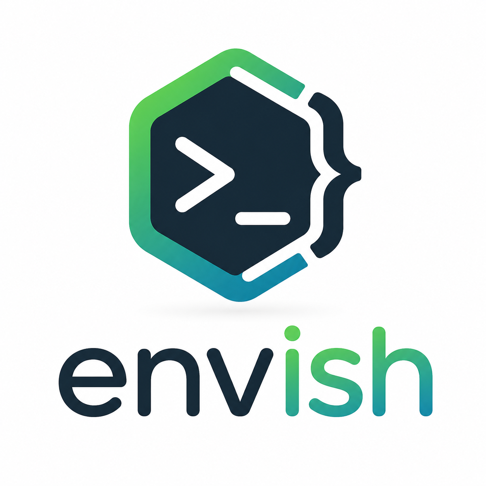

# envish



Load named environment profiles from a TOML config into a nested shell.

<br clear="left"/>

## Why envish?

Project-local `.env` files scatter the same setups across repos. envish keeps **named profiles in one global TOML config** you can sync with your dotfiles.

- One shared config (or any file via `-c`), not a `.env` per project
- Explicit `load` into a nested shell — no shell hooks to install
- Works alongside other tools (dotenv, direnv, etc.)
- Simple workflow: `edit` / `list` / `load` / `path`

## Install

```bash
# Download binary
curl -L https://github.com/enkidulan/envish/releases/latest/download/envish -o ~/.local/bin/envish
chmod +x ~/.local/bin/envish
```

Or from source:

```bash
cargo install --git https://github.com/enkidulan/envish
```

## Quick start

```bash
# Open the config in $VISUAL / $EDITOR
envish edit

# List profiles
envish list

# Start a shell with a profile applied
envish load dev
```

When you exit that shell, the parent environment is unchanged.

## Config

Default path (overridable with `-c` / `--config`):

| OS | Path |
|----|------|
| Linux | `~/.config/envish/config.toml` |
| macOS | `~/Library/Application Support/envish/config.toml` |
| Windows | `%APPDATA%\Enkidulan\envish\config.toml` |

Print the resolved path:

```bash
envish path
```

Example config:

```toml
[DEFAULT]
EDITOR = "nvim"

[dev]
API_URL = "http://localhost:3000"
DEBUG = "1"

[prod]
API_URL = "https://api.example.com"
DEBUG = "0"
```

Each top-level table is a profile. `[DEFAULT]` is optional and always applied first when you `load` another profile; that profile’s values override defaults on conflicts.

Values must be strings, numbers, booleans, or datetimes — not arrays or nested tables.

Treat this file like any other local secret store: keep credentials out of git, and prefer OS secret managers for sensitive material when you can.

## Commands

| Command | Description |
|---------|-------------|
| `envish load <name>` | Spawn `$SHELL` (or a platform default) with the profile's env vars |
| `envish edit` | Edit the config; writes only if the result is valid TOML |
| `envish list` | List profile names |
| `envish path` | Print the config file path |
| `envish -c FILE ...` | Use a custom config file |

## Releasing

Create and push an annotated version tag. CI builds the release binary and publishes a GitHub Release with the `envish` asset:

```bash
git tag -a v0.1.1 -m "v0.1.1"
git push origin v0.1.1
```

Confirm the release at https://github.com/enkidulan/envish/releases — the install curl URL uses `latest`, so it picks up the new binary automatically.

## License

MIT
